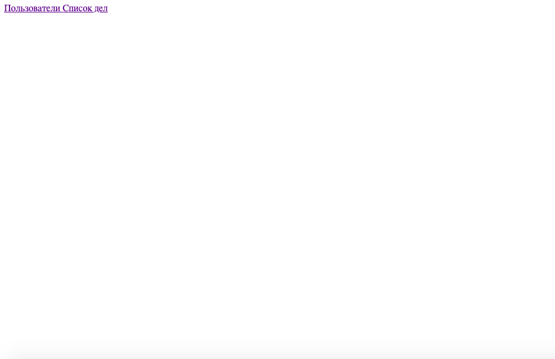
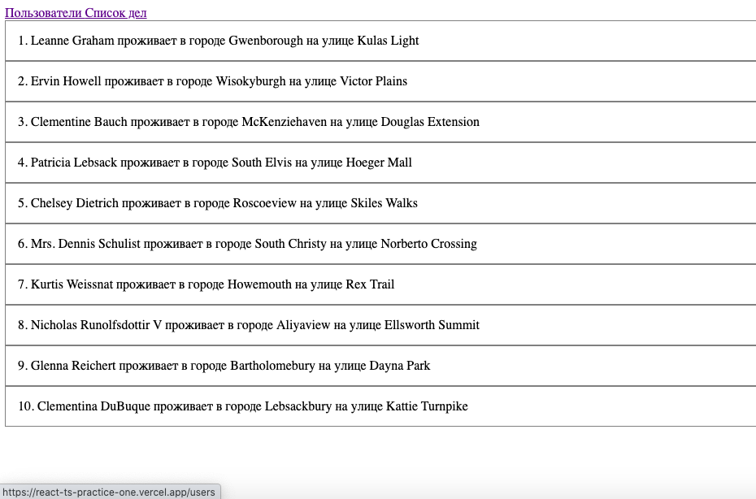
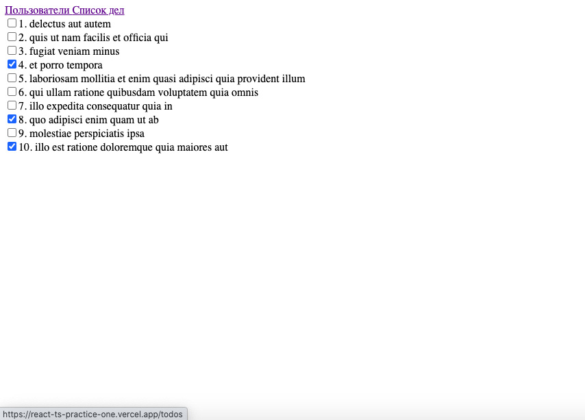

# Тизизация Реакта

Проект доступен по ссылке - https://react-ts-practice-one.vercel.app/

## Стек   

- React  
- Typescript  

В приложении типизированы пропсы компонентов, хуки, собыбия Реакта и React router dom

Функционал приложения: В ответ на запрос сервер отправляет список пользователей и список дел. При клике на пользователя открывается его "личная страница"

    

  

 

 

